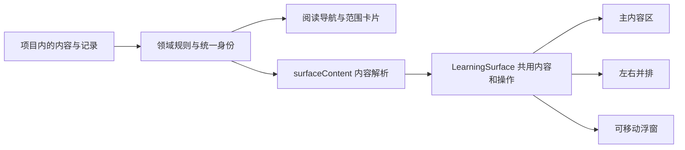

# SideReader 统一模型

本文件定义当前实现。旧设计与验收记录保留在 `docs/`；发生表述冲突时，以本文、`DESIGN.md` 和测试中的不变量为准。

## 术语与身份

| 术语 | 含义 | 实现 |
| --- | --- | --- |
| 项目 | 一本 PDF 的学习目标、章节和记录边界；旧内容身份保持兼容 | `Project` |
| 资料 | 一份导入源文件及其索引；PDF 字节单独保存 | `Source` |
| 章节 | 指向资料中固定物理页范围的位置，不复制文件 | `SourceSection` / chapter 节点 |
| 纸张 | 一个可继续输入的对话；有来源时挂在 PDF、章节或父纸张下 | `Chat` |
| 子纸张 | 从主对话或其子纸张衍生的追问，保留来源消息和引用 | `Chat.context` / `parentId` |
| 学习对象 | 图谱、关卡图、题目、代码、公式等可复用内容 | `domain/objects` 注册表及源实体 |
| 练习文件 | 持续练习或教材习题的容器；小检测可只有一两题 | `QuestionSet`，语义别名 `PracticeFile` |
| 对象视图 | 保存对象来源与快照的可寻址视图，不自动创建对话 | `Paper`，语义别名 `ObjectView` |
| 阅读导航 | 项目与 PDF 原目录；每个范围只挂独立主对话，末尾另附对象卡片 | `projectNavigationNodes` / `scopeAttachments` |
| 纸张树 | 进入主对话后展示其派生追问；对象专属对话也拥有自己的内部树 | `conversationNodes` |
| 范围附件卡片 | 项目或章节末尾的图谱与习题，点击或拖出为可移动卡片 | `scopeAttachments` / `PaperTree` |

`paper`、`book`、`path`、`questions` 等存储值和旧 ID 保留兼容，不作为 UI 术语照搬。历史用户标题与消息不会因统一名称而重写。对象类型、名称、渲染器和展示能力由 `domain/objects.mjs` 定义，类型从同一声明导出。

## 关系与偏序

这些关系共享身份和遍历规则，但有不同语义：

| 关系 | 约束 | 统一入口 |
| --- | --- | --- |
| 学习归属 | 对话属于项目或有效章节；固定范围优先于显示位置 | `conversationOwner` / `knowledgeGraphOwner` |
| 纸张衍生 | PDF / 章节 → 纸张 → 子纸张；对象中间节点不进入可视树 | `projectNavigationNodes` / `newConversationParent` |
| 资料包含 | 原文件、章节、书签复用同一个 source ID | `domain/documents` / `domain/relations` |
| 来源引用 | 消息、选区、页码、题目原文引用可跨范围，不更改归属 | `ReadingAnchor` / `Chat.context` / `Paper` |
| 关卡先修 | 有向无环关系，可多父节点，不限于一棵树 | `hasDirectedPath` / `prerequisiteWouldCycle` |
| 概念关联 | 一般图，允许环，不冒充学习先后顺序 | `Concept.links` / `graph-layout` |

`domain/relations.mjs` 负责稳定索引、父链读取、环检测、章节合法性与定位。旧 `parentId` 是兼容存储边，不能直接当成所有权或 UI 层级。损坏父链的遍历有界；重复 ID 采用首条记录。导航投影不会改写已有追问依据。侧栏只显示独立主对话；同一对话中的追问子树通过 `conversationNodes` 在对话内部按需展开。子纸张打开后，侧栏仍定位其 `conversationRoot`，不复制节点或改变来源关系。章节及小节作为 PDF 中的位置保留在边栏，复用原文件并保持目录层级，独立章节对话在所属章节下显示。书签通过阅读器和资料管理访问。无可靠 PDF 来源的旧对话保留在项目下；孤儿和环被确定性地提升成可访问根，避免内容消失。

`projectReadingRoot` 以既有 PDF 源节点作为项目阅读入口，项目主对话统一投影在该入口下；无资料时回退项目 Tutor，不改写存储 ID。`scopeAttachments` 在项目或章节末尾提供独立于树层级的卡片：规范图谱自动出现，习题按固定 scope 或旧来源关系归档，包括 inline 小测与仅存于旧消息的题目。后者直接复用 `practiceCatalog` 身份，打开时才创建对象视图。

项目与章节拥有知识图谱，项目拥有唯一关卡图。章节图谱的显式空 `conceptIds` 是空图，不能回退到项目全集；旧非规范图保留为历史。关卡引用原文，不另建自己的章节图谱。

对话中的局部图谱是当前交流逻辑的独立快照，习题由教学工具按实际目的生成。对象专属对话用 `Chat.context.objectNodeId` 记录身份：首次追问才落库，后续追问复用，既不预建空会话，也不放进全局阅读导航。概念与题目引用送入同范围主对话，不因引用改写所属章节。`referenceScope` 按规范身份计算可用引用，接收拖拽、加载草稿和发送前均核对；已发消息保留引用快照。对象追问复用 `surfaceContent` 读取最新对象内容，原始摘录与消息历史保留。

侧栏「新对话」显式创建独立主对话；PDF「追问」由 `conversationForScope` 优先复用同范围当前对话，否则选择最近有用户互动的主对话，分支互动归入其主对话。`Chat.lastInteractionAt` 仅在新增用户问题时更新；旧记录用节点创建时间回退，空对话不挤掉已有互动。对象专属对话和其他章节不参与候选；无互动的项目保留 Tutor，章节首次提交才经 `ensureScopeConversation` 保存。

## 内容与空间



`LearningSurface` 统一图谱、关卡、练习与对象视图。三个空间只调整外框和密度，不各自维护内容副本。题目均按同一个 object ID 使用草稿和作答记录；源题目被编辑后，视图读取当前题目；源已移除时，保留原快照。关闭浮窗或收起对照不会删除内容。

`object-provenance` 从真实归属与来源记录生成标签，`ObjectContext` 在图谱、题集和单题视图中呈现。未标注来源的旧习题只称「习题」；对话图谱回链要求原对话及确切消息仍存在。对话内和展开的图谱都以单击查看节点详情，以显式引用按钮或拖拽加入输入标签。

`renderReader` 统一主区与对照区的资料、章节范围、书签、选择和追问绑定。主区与对照区分别记录位置，追问按发起阅读器的实际页码捕获上下文。PDF 选择菜单就近提供追问、加书签和复制；页书签与摘录书签可同页共存。

`EvidenceCitation` 先预览行内来源，只有「打开原文」调用跳转。`reading-history` 按项目维护临时 LIFO 访问栈，保存主侧内容与布局、各阅读器页码及 `reader-sessions` 的页内偏移、缩放、文本模式快照；返回时恢复快照并跳过已不可用的访问。`currentReaderPage` 供显示与历史捕获共用，避免未加载的侧栏回退到错误进度。`reader-sessions.restore` 更新转移版本，拒绝迟到的旧视图保存覆盖恢复结果。访问栈与会话快照为内存状态，不生成书签；页码继续沿用既有阅读进度保存规则。

常态布局是左侧阅读导航、中央 PDF、右侧同范围对话。打开侧栏主对话、图谱或习题保留 PDF，并装入右侧；章节切换不重新打开已关闭的旁栏。空白的首次输入在提交前不制造持久化纸张。PDF、对话、图谱、习题均可通过拖拽或常驻的「视图」菜单成为主视觉、旁栏或浮窗。`workspace-placement` 统一空间变换：主侧互换保留两项内容；新主视觉保留当前旁栏；浮窗移出原位置，由其余可见内容或原文接替；重复放置不复制视图。`workspaceViews` 按项目保存主视觉、旁栏显示和左右位置；缺失或损坏偏好回到阅读默认布局。

浮窗来源导航通过 `navigateFloatingContent` 复用已经可见的目标对话；目标未显示时替换发起导航的浮窗，保留主侧内容，不叠加重复浮窗。

拖拽以内容与落点决定意图，由 `object-transfer` 传递同项目的稳定身份，接收方重新解析内容：

| 拖动内容 | 落点与结果 |
| --- | --- |
| PDF / 章节 / 对话 / 学习对象卡片 | 中央替换主视觉，左右边缘并排，底部中央浮窗；不改变来源关系 |
| 浮动卡片 | 标题与六点把手共用 Pointer Events 移动手势、角落调整大小；顶中央或左右停靠区升级为主视觉或并列 |
| 图谱概念节点或单道习题 | 拖入同范围对话输入区添加引用，不切换视图、不自动发送 |

拖动前不常驻大面积落点提示，拖动时显示全部可用位置并高亮当前落点；「视图」菜单提供点击和键盘替代。图谱节点引用使用独立协议，不会被工作区误判为布局拖放。对话内的对象卡片与其打开的视图使用同一实体、题目草稿与作答记录。

`ConversationWorkspace` 展示当前纸张，有追问时提供一个按需展开的内部纸张树，复用原 Chat 身份且只包括所属主对话。主区、并列区与浮窗各自在本区切换，不设置“对话 / 纸张树 / 桌面”模式。标题栏常驻内容类型、标题、视图与退出入口，不重复列图谱、关卡和练习跳转按钮。

## 文件与持久化

实际文件与学习内容分层：IndexedDB 保存项目内容和 PDF 字节；资料 ID 关联字节、索引、章节与书签。练习文件是项目内结构化内容，不额外写一个操作系统文件；导航树是可查找投影，不是另一套内容数据库。

`domain/documents` 统一资料寻址、页码限制、阅读进度、书签和移除语义。移除源资料保留对话、图谱与作答历史；不会把旧对话的固定来源改成当前页。练习编辑通过 canonical 文件 ID 替换本文件，不覆盖其他文件。

存储地址与版本集中在 `persistence/keys`；项目与资料通过 repository；偏好和草稿通过 preferences。旧键不改，读取项目失败时停止自动保存；可选布局偏好损坏只回退布局。详见 [持久化与文件职责](docs/persistence-and-filesystem.md)。

## 依赖方向

```text
components / App → 领域选择器与命令
components / App → services → persistence
components / App → persistence
server           → 共享纯领域模块
纯领域模块        → 其他纯领域模块（不读取 DOM、浏览器存储或 HTTP）
```

- `domain/types.ts` 是领域类型入口，根 `types.ts` 兼容旧 import。
- `services/` 管 HTTP、Tutor 流、PDF 引擎与远程文件回退。
- `persistence/` 只管本机保存，不反向依赖服务或 UI；根 `storage.ts` 只保留兼容导出。
- 老根目录 `.mjs` 保留已有业务模块路径，继续作为纯领域模块；不为改名进行破坏性大搬迁。
- 直接使用的第三方包在 `package.json` 明确声明，版本以锁文件为准。KaTeX、esbuild 不再借用其他包的传递依赖；本次不升级依赖。
- `npm run check:architecture` 检查依赖方向、直接依赖、存储与 HTTP 入口以及锁文件一致性。

## 验证

```bash
npm run check:architecture
npm test
npm run build
```

回归重点：旧项目归属与身份保留、章节选择一致性、先修环、显式空集合、题目跨视图实时解析、局部保存隔离、资料移除后的学习记录、书签保真、流取消与读取失败保护。页面验收必须使用 Safari 实机，模型请求用隔离 mock 测试；不通过重构验收改写用户答案或发送测试提问。

当前回归还需覆盖：从每种位置拖同一对象、历史题目快照拖出、章节目录层级、对话归属与 PDF 定位、主视觉/并列/卡片之间切换、旧对话与作答记录不丢失。实机验收记录见 [纸张与拖拽](docs/paper-tree-design.md)。
